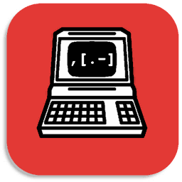

<p float="left">
<a href="../../"></a>
<a href="https://www.codacy.com/manual/FredHappyface/Java.BrainfInterpreter"></a>
<a href="https://www.codacy.com/manual/FredHappyface/Java.BrainfInterpreter"></a>
<a href="../../"></a>
<a href="../../issues"></a>
<a href="/LICENSE.md"></a>
<a href="../../commits/master"></a>
<a href="../../commits/master"></a>
</p>

# Java.BrainfInterpreter



The aim of this Java project is to parse a file with extention .b or .bf and to
produce an interpreter for the 'Brainf' programming language.

## Download
### Clone
#### Using The Command Line
1. Press the Clone or download button in the top right
2. Copy the URL (link)
3. Open the command line and change directory to where you wish to
clone to
4. Type 'git clone' followed by URL in step 2
```bash
$ git clone https://github.com/FredHappyface/Java.Brainf
```

More information can be found at
<https://help.github.com/en/articles/cloning-a-repository>

#### Using GitHub Desktop
1. Press the Clone or download button in the top right
2. Click open in desktop
3. Choose the path for where you want and click Clone

More information can be found at
<https://help.github.com/en/desktop/contributing-to-projects/cloning-a-repository-from-github-to-github-desktop>

### Download Zip File

1. Download this GitHub repository
2. Extract the zip archive
3. Copy/ move to the desired location


## Language information
### Built for
This program has been written in Java using Visual Studio Code.
Download from <https://code.visualstudio.com/> and follow the instructions
### OpenJDK11 (recommended)
Install with chocolatey
```powershell
choco install openjdk11
```
or download and install from
<https://wiki.openjdk.java.net/display/JDKUpdates/JDK11u>
### OracleJDK11
Install with chocolatey
```powershell
choco install jdk11
```
or download and install from
<https://www.oracle.com/technetwork/java/javase/downloads/jdk11-downloads-5066655.html>
### Plugin requirements
Install the Java Extension Pack (vscjava.vscode-java-pack) Plugin. This should
install Language Support for Java™ by Red Hat, Debugger for Java, Java Test
Runner, Maven Project Explorer, and Java Dependency Viewer
## How to run
### Method 1 - Visual Studio Code
1. Download or clone this GitHub repository
2. (If downloaded) Extract the zip archive
3. Open the directory containing the main.java file into Visual Studio Code
4. Run the program with F5
### Method 2 - Eclipse
1. Download or clone this GitHub repository
2. (If downloaded) Extract the zip archive
3. Copy the .java file(s) into a new project
4. Run the program with Ctrl+F11


## Licence
MIT License
Copyright (c) FredHappyface
(See the [LICENSE](/LICENSE.md) for more information.)
